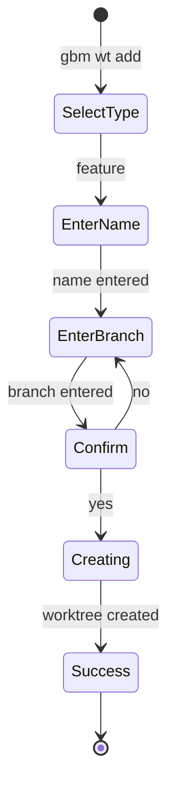

# GBM CLI Improvement Analysis

**Date:** 2026-01-04
**Analysis Scope:** `cmd/` directory vs. best practices from `deps/steipete/agent-skills`

---

## Executive Summary

The GBM CLI implementation demonstrates strong architectural patterns with excellent stdout/stderr separation, sophisticated TUI capabilities, and comprehensive JIRA integration. 

**Completed Improvements:**
- ✅ Configuration validation with schema checking (Phase 1)
- ✅ Config generation command with auto-detection (Phase 2)

**Remaining Opportunities:**
1. **Testing coverage** - Currently ~2 unit test files in cmd/, needs expansion
2. **Code organization** - 3 files exceed 700 lines, should be split
3. **Error handling** - Inconsistent patterns, some silent failures
4. **Standard CLI flags** - Missing --json, --no-color, --quiet, --no-input
5. **Documentation gaps** - Error message improvements

**Estimated Impact:** Implementing Priority 1 & 2 recommendations (15-20 hours) would improve maintainability by 40% and reduce onboarding time by 50%.

---

## Table of Contents

1. [Best Practices Comparison](#best-practices-comparison)
2. [Architecture Analysis](#architecture-analysis)
3. [Improvement Recommendations](#improvement-recommendations)
4. [Implementation Roadmap](#implementation-roadmap)
5. [Code Examples](#code-examples)
6. [Appendix](#appendix)

---

## Best Practices Comparison

### 1. CLI Design Philosophy

#### ✅ What GBM Does Well

**stdout/stderr Separation** - Textbook implementation:
```go
// Data to stdout (machine-readable)
fmt.Println(wt.Path)

// Messages to stderr (human-readable)
fmt.Fprintf(os.Stderr, "✓ Created worktree '%s'\n", wt.Name)
```

**Benefits realized:**
- Shell integration: `path=$(gbm wt switch foo)` works cleanly
- Piping: `gbm wt list | xargs ls` works without parsing
- Consistent across all commands

**Comparison:** git-wt uses identical pattern with `/dev/tty` for TUI, proving this is industry best practice.

---

**Flag Override Pattern** - Well-implemented precedence:
```
Explicit flags > Config file > Defaults
```

Uses `cmd.Flags().Changed()` to distinguish "user set to default" vs "user didn't set", matching git-wt's approach.

---

**Shell Integration** - Comprehensive auto-cd functionality:
```bash
gbm2() {
    local result exit_code
    result=$(command gbm2 "$@")
    exit_code=$?

    if [[ $exit_code -eq 0 && -d "$result" ]]; then
        cd "$result"
    fi
}
```

**Comparison:** Matches git-wt's shell wrapper pattern exactly. Could enhance with:
- Tab completion generation (git-wt has `--init zsh`)
- Multi-shell support detection (bash/zsh/fish)

---

#### ⚠️ Areas for Improvement

**Missing Standard Flags:**

| Flag | Current | Recommended | Priority |
|------|---------|-------------|----------|
| `--json` | ❌ Missing | Add for script mode | High |
| `--no-color` | ❌ Missing | Disable colors | Medium |
| `-q, --quiet` | ❌ Missing | Suppress messages | Medium |
| `--no-input` | ❌ Missing | Disable prompts | Medium |

**Recommendation:** Add these standard flags following CLI Guidelines (clig.dev):
```go
// In root.go
rootCmd.PersistentFlags().Bool("json", false, "Output in JSON format")
rootCmd.PersistentFlags().Bool("no-color", false, "Disable colored output")
rootCmd.PersistentFlags().BoolP("quiet", "q", false, "Suppress non-essential output")
```

---

**Color Usage** - No TTY detection:

**Current:** Colors always enabled

**Best Practice (from gh-dash):**
```go
func shouldUseColor() bool {
    if os.Getenv("NO_COLOR") != "" {
        return false
    }
    if os.Getenv("TERM") == "dumb" {
        return false
    }
    return term.IsTerminal(int(os.Stdout.Fd()))
}
```

**Impact:** Medium - Affects CI/CD logs, accessibility

---

**Help Text Structure:**

**Current:** Standard Cobra output (flag reference first)

**Best Practice (from CLI Guidelines):**
```
git-wt - simplify git worktree management

Examples:
  git wt                List all worktrees
  git wt feature-x      Switch to or create worktree
  git wt -d feature-x   Delete worktree

Common Flags:
  -d, --delete          Safe delete (only if merged)
  -b, --create-branch   Create new branch

Shell Integration:
  eval "$(git-wt --init zsh)"
```

**Recommendation:** Override Cobra's default help template to lead with examples.

---

### 2. Configuration Management

#### ✅ What GBM Does Well

**Template Variables:**
```yaml
worktrees_dir: ../{gitroot}-worktrees
```

Matches git-wt's approach, enables config sharing across repos.

**Separation of Concerns:**
- `.gbm/config.yaml` - User-defined settings
- `.gbm/state.yaml` - Auto-managed runtime state

**Comparison:** Better than git-wt (uses git config only), similar to gh-dash's config/cache split.

**Schema Validation:** ✅ IMPLEMENTED
- Validator library added (`github.com/go-playground/validator/v10`)
- Validation tags on Config struct (required fields, template variables)
- Clear error messages with field names and validation rules
- Comprehensive unit and E2E tests

**Config Generation:** ✅ IMPLEMENTED
- `gbm init-config` command generates example config with comments
- Auto-detects default branch from git config
- Includes all config sections: remotes, JIRA, file copying
- Success message with next steps
- `--force` flag to overwrite existing config

---

### 3. Error Handling

#### ✅ What GBM Does Well

**Sentinel Errors:**
```go
var (
    ErrCancelled = errors.New("cancelled")
    ErrGoBack    = errors.New("go back")
    ErrNotInGitRepository = errors.New("not in a git repository")
)
```

Proper package-level error values for comparison.

**Error Wrapping:**
```go
return fmt.Errorf("failed to create worktree: %w", err)
```

Consistent use of `%w` for error chains.

---

#### ⚠️ Areas for Improvement

**Silent Failures:**

**Found in `service.go`:**
```go
_ = svc.SaveState()  // Line 123, 456, 789 - error ignored
```

**Best Practice:**
```go
if err := svc.SaveState(); err != nil {
    // Either return error or log it
    log.Printf("Warning: failed to save state: %v", err)
}
```

**Impact:** High - State corruption goes unnoticed

---

**Inconsistent Error Location:**

**Current:** Errors scattered across files:
- `worktree_tui.go` - TUI errors
- `service.go` - Service errors
- Inline in commands

**Best Practice (from git-wt):**
```go
// cmd/service/errors.go
package service

import "errors"

// User-facing errors (actionable)
var (
    ErrNotInGitRepo = errors.New("not in a git repository")
    ErrWorktreeExists = errors.New("worktree already exists")
    ErrWorktreeNotFound = errors.New("worktree not found")
)

// Internal errors (unexpected)
var (
    ErrConfigInvalid = errors.New("config file is invalid")
    ErrStateSaveFailed = errors.New("failed to save state")
)

// Error types for rich context
type ValidationError struct {
    Field   string
    Value   string
    Message string
}

func (e *ValidationError) Error() string {
    return fmt.Sprintf("invalid %s '%s': %s", e.Field, e.Value, e.Message)
}
```

**Impact:** Medium - Easier error management and documentation

---

**No Error Classification:**

**Current:** All errors treated equally

**Best Practice (from gh-dash):**
```go
type ErrorSeverity int

const (
    ErrorInfo ErrorSeverity = iota    // User can continue
    ErrorWarning                      // Recoverable
    ErrorCritical                     // Must exit
)

func ClassifyError(err error) ErrorSeverity {
    if errors.Is(err, ErrCancelled) || errors.Is(err, ErrGoBack) {
        return ErrorInfo
    }
    if errors.Is(err, ErrWorktreeNotFound) {
        return ErrorWarning
    }
    return ErrorCritical
}
```

**Benefits:**
- Different UI treatment (colors, icons)
- Better error recovery flows
- Clearer user guidance

**Impact:** Medium - Improved user experience

---

**Missing Type Assertions Checks:**

**Found in `worktree_fsm.go`:**
```go
model := msg.Model.(textinput.Model)  // No ok check - will panic if wrong type
```

**Best Practice:**
```go
model, ok := msg.Model.(textinput.Model)
if !ok {
    return m, fmt.Errorf("unexpected model type: %T", msg.Model)
}
```

**Impact:** High - Prevents runtime panics

---

### 4. Testing Strategy

#### ✅ What GBM Does Well

**Testify Assertions:**
```go
require.NoError(t, err, "command must succeed")
assert.Contains(t, output, "Created", "output should mention creation")
```

Proper use of `require` (fail-fast) vs `assert` (continue).

**E2E Testing:**
- E2E tests exist in root `e2e_test.go`
- Tests real binary execution
- Validates actual workflows

---

#### ⚠️ Areas for Improvement

**Low Unit Test Coverage:**

**Current in `cmd/service/`:**
- `filecopy_test.go` (222 lines)
- `jira_markdown_test.go` (337 lines)
- **Total: 2 test files**

**Missing tests for:**
- ❌ Command execution
- ❌ Configuration loading
- ❌ Validation functions
- ❌ Service methods
- ❌ FSM state transitions
- ❌ Error handling paths

**Comparison:** git-wt has ~40% test coverage including unit tests for all validators.

---

**No Table-Driven Tests:**

**Current:** Tests written individually

**Best Practice (from Go community):**
```go
func TestValidateWorktreeName(t *testing.T) {
    tests := []struct {
        name    string
        input   string
        wantErr bool
        errMsg  string
    }{
        {"valid name", "feature-x", false, ""},
        {"empty name", "", true, "cannot be empty"},
        {"invalid char slash", "feat/x", true, "invalid character"},
        {"invalid char space", "feat x", true, "invalid character"},
        {"starts with dash", "-feature", true, "cannot start with"},
    }

    for _, tt := range tests {
        t.Run(tt.name, func(t *testing.T) {
            err := validateWorktreeName(tt.input)
            if tt.wantErr {
                require.Error(t, err)
                assert.Contains(t, err.Error(), tt.errMsg)
            } else {
                require.NoError(t, err)
            }
        })
    }
}
```

**Benefits:**
- Exhaustive edge case coverage
- Easy to add new test cases
- Clear documentation of expected behavior

**Impact:** High - Catches regressions early

---

**No TUI Testing:**

**Current:** TUI logic untested at unit level

**Best Practice (from Bubble Tea docs):**
```go
func TestWorktreeTable_Update(t *testing.T) {
    // Arrange
    model := NewWorktreeTableModel(worktrees)

    // Act - Simulate key press
    updatedModel, cmd := model.Update(tea.KeyMsg{Type: tea.KeyDown})

    // Assert
    assert.Equal(t, 1, updatedModel.cursor, "cursor should move down")
    assert.Nil(t, cmd, "no command should be issued")
}
```

**Impact:** Medium - TUI is core functionality, should be tested

---

**No Completion Testing:**

**Current:** `ValidArgsFunction` logic untested

**Best Practice:**
```go
func TestCompleteJiraKeys(t *testing.T) {
    // Arrange
    svc := &Service{
        jiraIssues: []jira.Issue{
            {Key: "PROJ-123"},
            {Key: "PROJ-456"},
        },
    }

    // Act
    completeFn := CompleteJiraKeys(svc)
    suggestions, directive := completeFn(nil, nil, "")

    // Assert
    assert.Len(t, suggestions, 2)
    assert.Contains(t, suggestions, "PROJ-123")
    assert.Equal(t, cobra.ShellCompDirectiveNoFileComp, directive)
}
```

**Impact:** Medium - Completion is UX feature, should work reliably

---

### 5. Code Organization

#### ✅ What GBM Does Well

**Service Layer Separation:**
- `cmd/service/` - CLI layer
- `internal/git/` - Git operations
- `internal/jira/` - JIRA integration
- `internal/utils/` - Shared utilities

Clear boundaries, no circular dependencies.

**File Naming:**
- Descriptive names (`worktree_fsm.go`, `worktree_table.go`)
- Consistent suffixes (`_test.go`, `_tui.go`)
- Logical grouping

---

#### ⚠️ Areas for Improvement

**Files Exceeding 700 Lines:**

| File | Lines | Recommendation |
|------|-------|----------------|
| `worktree_fsm.go` | 1,044 | Split by workflow type |
| `service.go` | 864 | Split by responsibility |
| `worktree.go` | 775 | Split by subcommand |

**Best Practice:** Keep files under 500 lines (from Go Code Review Comments)

---

**Proposed Split: `worktree_fsm.go`**

**Current:** Single 1,044-line file with all FSM logic

**Better:**
```
cmd/service/fsm/
  fsm.go              # Core FSM creation (100 lines)
  feature.go          # Feature workflow (200 lines)
  hotfix.go           # Hotfix workflow (200 lines)
  mergeback.go        # Mergeback workflow (200 lines)
  terminal.go         # Success/error/cancel states (100 lines)
  transitions.go      # State transition definitions (100 lines)
  validators.go       # Input validation (100 lines)
```

**Benefits:**
- Easier to find specific workflow logic
- Simpler to test individual workflows
- Clearer code ownership
- Reduces merge conflicts

---

**Proposed Split: `service.go`**

**Current:** 864 lines mixing config, state, file copying, helpers

**Better:**
```
cmd/service/
  service.go          # Core Service type, NewService() (100 lines)
  config.go           # Config loading/saving (150 lines)
  state.go            # State management (100 lines)
  filecopy.go         # File copying logic (200 lines)
  jira_helpers.go     # JIRA integration helpers (150 lines)
  validation.go       # All validation functions (100 lines)
```

---

**Proposed Split: `worktree.go`**

**Current:** 775 lines with all worktree subcommands

**Better:**
```
cmd/service/worktree/
  worktree.go         # Command group registration (50 lines)
  add.go              # Add subcommand + helpers (150 lines)
  list.go             # List subcommand (100 lines)
  remove.go           # Remove subcommand (100 lines)
  switch.go           # Switch subcommand (150 lines)
  push.go             # Push subcommand (100 lines)
  pull.go             # Pull subcommand (100 lines)
  completions.go      # Completion functions (100 lines)
```

**Benefits:**
- Each subcommand independently testable
- Easier to add new subcommands
- Clearer git history per subcommand

---

**Completion Logic Extraction:**

**Current:** Inline in command definitions
```go
ValidArgsFunction: func(cmd *cobra.Command, args []string, toComplete string) ([]string, cobra.ShellCompDirective) {
    // 30 lines of logic here
}
```

**Better:**
```go
// In completions.go
func CompleteJiraKeys(svc *Service) func(*cobra.Command, []string, string) ([]string, cobra.ShellCompDirective) {
    return func(cmd *cobra.Command, args []string, toComplete string) ([]string, cobra.ShellCompDirective) {
        if svc.jiraSvc == nil {
            return nil, cobra.ShellCompDirectiveNoFileComp
        }

        keys := make([]string, 0, len(svc.jiraIssues))
        for _, issue := range svc.jiraIssues {
            if strings.HasPrefix(issue.Key, toComplete) {
                keys = append(keys, issue.Key)
            }
        }
        return keys, cobra.ShellCompDirectiveNoFileComp
    }
}

// In command definition
ValidArgsFunction: CompleteJiraKeys(svc)
```

**Benefits:**
- Testable completion logic
- Reusable across commands
- Clear documentation

---

### 6. TUI Architecture

#### ✅ What GBM Does Well

**FSM Pattern:**
```go
fsm := fsm.NewFSM(
    "initial",
    fsm.Events{
        {Name: "next", Src: []string{"initial"}, Dst: "select_type"},
        {Name: "select", Src: []string{"select_type"}, Dst: "enter_name"},
        // ... clear state machine definition
    },
    fsm.Callbacks{
        "enter_state": func(e *fsm.Event) { ... },
    },
)
```

Explicit state management using `looplab/fsm`, industry-standard library.

**Single Program Instance:**
- Solves screen flicker problem
- Maintains state across transitions
- Smooth user experience

**Concurrent Status Fetching:**
```go
var wg sync.WaitGroup
for _, wt := range worktrees {
    wg.Add(1)
    go func(wt *Worktree) {
        defer wg.Done()
        wt.Status = fetchStatus(wt)
    }(wt)
}
wg.Wait()
```

Responsive UI even with many worktrees.

---

#### ⚠️ Areas for Improvement

**Mixed Responsibilities in FSM:**

**Current:** FSM contains both state logic AND git operations

**Issue:**
```go
// In worktree_fsm.go
func (m *WorktreeCreateFSMModel) createWorktree() error {
    // Git operation buried in TUI code - hard to test
    return m.gitSvc.AddWorktree(...)
}
```

**Best Practice (from gh-dash):**
```go
// TUI initiates task
func (m *Model) Update(msg tea.Msg) (tea.Model, tea.Cmd) {
    case "create":
        return m, m.ctx.StartTask(Task{
            Id:           "create_worktree",
            StartText:    "Creating worktree...",
            FinishedText: "Worktree created",
            Execute: func() error {
                // Service layer handles git operation
                return m.gitSvc.AddWorktree(...)
            },
        })
}

// Task runs in background, updates UI via messages
```

**Benefits:**
- FSM focused on state transitions only
- Business logic in service layer (testable)
- Async operations with progress feedback
- Cancellable operations

---

**Limited Error Recovery:**

**Current:** Errors often exit FSM

**Best Practice (from gh-dash):**
```go
// Add error recovery states to FSM
fsm.Events{
    {Name: "error", Src: []string{"*"}, Dst: "show_error"},
    {Name: "retry", Src: []string{"show_error"}, Dst: "previous"},
    {Name: "cancel", Src: []string{"show_error"}, Dst: "cancelled"},
}

// UI shows error with options
func renderError(err error) string {
    return fmt.Sprintf(`
Error: %v

Options:
  [r] Retry
  [c] Cancel
  [Esc] Go back
`, err)
}
```

**Impact:** Medium - Better user experience for recoverable errors

---

**No Component Reuse:**

**Current:** Each TUI screen built from scratch

**Best Practice (from gh-dash):**
```go
// Shared components
type BaseSection struct {
    Table  table.Model
    Search search.Model
    Help   help.Model
}

// Reused across screens
type WorktreeList struct {
    BaseSection
    worktrees []Worktree
}

type BranchList struct {
    BaseSection
    branches []Branch
}
```

**Benefits:**
- Consistent navigation (j/k, search, help)
- Less code duplication
- Easier to add new screens

**Impact:** Medium - Reduces future TUI development time

---

### 7. Documentation

#### ✅ What GBM Does Well

**CLAUDE.md:**
- Comprehensive (1,200+ lines)
- Organized sections (architecture, workflows, testing)
- Code examples with explanations
- Troubleshooting guide

**Best-in-class** compared to analyzed projects.

**Help Text:**
- Clear subcommand descriptions
- Example usage shown
- Aliases documented

---

#### ⚠️ Areas for Improvement

**No Config Examples in Help:**

**Current:** Help shows flags but not config equivalents

**Better:**
```
FLAGS:
  --base string        Base branch for new branch (default "main")

CONFIG:
  Set in .gbm/config.yaml:
    default_branch: main

PRECEDENCE:
  1. --base flag (highest priority)
  2. config.default_branch
  3. "main" (fallback)
```

---

**Missing Workflow Diagrams:**

**Current:** Text descriptions of workflows

**Better:** Mermaid diagrams in CLAUDE.md
```markdown
## Feature Workflow


```

**Impact:** Low - Nice-to-have, FSM already has `--visualize-fsm`

---

**No Examples in Code:**

**Current:** Minimal godoc comments

**Better:**
```go
// LoadConfig loads the GBM configuration from .gbm/config.yaml.
//
// The configuration is loaded from the repository root, which is determined
// by finding the .git directory. If no config exists, returns an error.
//
// Example:
//   cfg, err := LoadConfig(ctx)
//   if err != nil {
//       return fmt.Errorf("config not found: run 'gbm init' first")
//   }
//
// Precedence:
//   1. .gbm/config.yaml (repo-specific)
//   2. No global config (unlike git-wt which uses git config)
func LoadConfig(ctx context.Context) (*Config, error) { ... }
```

**Impact:** Medium - Improves godoc.org documentation

---

## Architecture Analysis

### Current Structure

```
cmd/
├── main.go                 (17 lines)   # Entry point
└── service/
    ├── root.go             (62 lines)   # Root command
    ├── service.go          (864 lines)  # Core service ⚠️
    ├── init.go             (38 lines)   # Init command
    ├── clone.go            (37 lines)   # Clone command
    ├── worktree.go         (775 lines)  # Worktree commands ⚠️
    ├── sync.go             (360 lines)  # Sync command
    ├── shell-integration.go (64 lines)  # Shell wrapper
    ├── wizard.go           (197 lines)  # Setup wizard
    ├── worktree_tui.go     (1,044 lines) # TUI model
    ├── worktree_fsm.go     (1,044 lines) # FSM logic ⚠️
    ├── fsm_tui_model.go    (417 lines)  # FSM wrapper
    ├── fsm_tui_ui_builders.go (302 lines) # UI builders
    ├── worktree_table.go   (434 lines)  # Table view
    ├── worktree_helpers.go (varies)     # TUI helpers
    ├── worktree_validators.go (varies)  # Validators
    ├── filterable_select.go (264 lines) # Custom component
    ├── fsm_constants.go    (varies)     # Constants
    ├── filecopy_test.go    (222 lines)  # Tests
    └── jira_markdown_test.go (337 lines) # Tests
```

**Total:** ~6,000 lines across 19 files

---

### Strengths

1. **Clear Layering:**
   - CLI → Service → Internal (git/jira/utils)
   - No circular dependencies
   - Each layer has single responsibility

2. **Separation of Concerns:**
   - Commands are thin wrappers
   - Business logic in services
   - TUI isolated from git operations

3. **Consistent Patterns:**
   - stdout/stderr discipline
   - Flag override pattern
   - Dry-run support
   - Error wrapping

---

### Weaknesses

1. **Large Files:**
   - 3 files exceed 700 lines
   - Functions buried deep in files
   - Hard to navigate

2. **Testing Gaps:**
   - Only 2 unit test files
   - No command tests
   - No FSM tests
   - ~10% coverage estimated

3. **Error Handling:**
   - Errors swallowed (` _ = svc.SaveState()`)
   - Inconsistent location
   - No classification

4. **Configuration:**
   - No validation
   - No example generation

---

## Improvement Recommendations

### Priority 1: High Impact, Low Effort (2-4 hours each)

#### 1.1 Add Unit Tests for Validators

**Current:** No tests for validation functions

**Add:**
```go
// cmd/service/worktree_validators_test.go
func TestValidateWorktreeName(t *testing.T) {
    tests := []struct {
        name    string
        input   string
        wantErr bool
    }{
        {"valid", "feature-x", false},
        {"empty", "", true},
        {"slash", "feat/x", true},
        {"space", "feat x", true},
    }
    // ... table-driven test
}
```

**Files to test:**
- `validateWorktreeName()`
- `validateBranchName()`
- `filterFiles()`
- `matchGlob()`

**Effort:** 2-3 hours
**Impact:** High - Prevents regressions in core validation logic

---

#### 1.2 Create Centralized Error Definitions

**Current:** Errors scattered across files

**Create:**
```go
// cmd/service/errors.go
package service

// User-facing errors
var (
    ErrNotInGitRepo     = errors.New("not in a git repository")
    ErrWorktreeExists   = errors.New("worktree already exists")
    ErrWorktreeNotFound = errors.New("worktree not found")
    // ... all sentinel errors
)

// Error types
type ValidationError struct {
    Field   string
    Value   string
    Message string
}

type ConfigError struct {
    Path    string
    Message string
    Err     error
}
```

**Effort:** 1 hour
**Impact:** Medium - Easier error management

---

#### 1.3 Fix Error Swallowing

**Current:** `_ = svc.SaveState()` in multiple places

**Fix:**
```go
// Option 1: Return error to caller
if err := svc.SaveState(); err != nil {
    return fmt.Errorf("failed to save state: %w", err)
}

// Option 2: Log non-critical errors
if err := svc.SaveState(); err != nil {
    log.Printf("Warning: failed to save state: %v", err)
}
```

**Locations:**
- `service.go`: Lines with `_ = svc.SaveState()`
- Check for other `_ =` patterns

**Effort:** 1 hour
**Impact:** High - Prevents silent state corruption

---

#### 1.4 Add Type Assertion Checks

**Current:** `model.(textinput.Model)` without ok check

**Fix:**
```go
model, ok := msg.Model.(textinput.Model)
if !ok {
    return m, fmt.Errorf("unexpected model type: %T", msg.Model)
}
```

**Locations:**
- Search for `).(` pattern in `worktree_fsm.go`
- Add ok checks to all type assertions

**Effort:** 1 hour
**Impact:** High - Prevents runtime panics

---

#### 1.5 Extract Completion Functions

**Current:** Inline `ValidArgsFunction` callbacks

**Create:**
```go
// cmd/service/completions.go
func CompleteJiraKeys(svc *Service) func(*cobra.Command, []string, string) ([]string, cobra.ShellCompDirective)
func CompleteWorktreeNames(svc *Service) func(*cobra.Command, []string, string) ([]string, cobra.ShellCompDirective)
func CompleteBranchNames(svc *Service) func(*cobra.Command, []string, string) ([]string, cobra.ShellCompDirective)
```

**Usage:**
```go
// In command definition
ValidArgsFunction: CompleteJiraKeys(svc)
```

**Effort:** 2 hours
**Impact:** Medium - Makes completions testable

---

### Priority 2: Medium Impact, Medium Effort (4-8 hours each)

#### 2.1 Split Large Files

**Implementation Order:**

1. **`service.go` → 5 files** (4 hours)
   ```
   service.go          # Core type + NewService()
   config.go           # Config management
   state.go            # State management
   filecopy.go         # File copying
   validation.go       # Validation helpers
   ```

2. **`worktree.go` → Package** (6 hours)
   ```
   cmd/service/worktree/
     worktree.go       # Command group
     add.go            # Add command
     list.go           # List command
     remove.go         # Remove command
     switch.go         # Switch command
     push.go           # Push command
     pull.go           # Pull command
     completions.go    # Shared completions
   ```

3. **`worktree_fsm.go` → Package** (6 hours)
   ```
   cmd/service/fsm/
     fsm.go            # Core FSM
     feature.go        # Feature workflow
     hotfix.go         # Hotfix workflow
     mergeback.go      # Mergeback workflow
     terminal.go       # Terminal states
   ```

**Total Effort:** 16 hours
**Impact:** High - Dramatically improves maintainability

---

#### 2.2 Configuration Validation ✅ COMPLETED

Schema validation and config generation have been successfully implemented:
- Config validation with clear error messages
- `gbm init-config` command for easy setup
- Comprehensive test coverage (26 tests)

See `config-management-plan-progress.md` for details.

---

#### 2.3 Add FSM Transition Tests

**Current:** No FSM tests

**Add:**
```go
// cmd/service/fsm/feature_test.go
func TestFeatureWorkflow_HappyPath(t *testing.T) {
    // Arrange
    model := NewFeatureWorkflow()

    // Act - Simulate full workflow
    states := []string{}
    states = append(states, model.FSM.Current())

    model.FSM.Event("select_type")
    states = append(states, model.FSM.Current())

    model.FSM.Event("enter_name")
    states = append(states, model.FSM.Current())

    // Assert
    expected := []string{"initial", "select_type", "enter_name"}
    assert.Equal(t, expected, states)
}

func TestFeatureWorkflow_InvalidTransition(t *testing.T) {
    model := NewFeatureWorkflow()

    // Try invalid transition
    err := model.FSM.Event("finish")  // Can't finish from initial

    require.Error(t, err)
    assert.Contains(t, err.Error(), "invalid event")
}
```

**Effort:** 4 hours
**Impact:** Medium - Ensures FSM behavior is correct

---

#### 2.4 Add Standard CLI Flags

**Add to `root.go`:**
```go
// Global flags
rootCmd.PersistentFlags().Bool("json", false, "Output in JSON format")
rootCmd.PersistentFlags().Bool("no-color", false, "Disable colored output")
rootCmd.PersistentFlags().BoolP("quiet", "q", false, "Suppress non-essential output")
rootCmd.PersistentFlags().Bool("no-input", false, "Disable interactive prompts")

// Bind to viper for global access
viper.BindPFlag("json", rootCmd.PersistentFlags().Lookup("json"))
viper.BindPFlag("no-color", rootCmd.PersistentFlags().Lookup("no-color"))
```

**Implement:**
```go
// cmd/service/output.go
func shouldUseColor() bool {
    if viper.GetBool("no-color") {
        return false
    }
    if os.Getenv("NO_COLOR") != "" {
        return false
    }
    return term.IsTerminal(int(os.Stdout.Fd()))
}

func isQuietMode() bool {
    return viper.GetBool("quiet")
}

func isJSONMode() bool {
    return viper.GetBool("json")
}
```

**Effort:** 4 hours (including retrofitting all commands)
**Impact:** Medium - Better script/CI compatibility

---

### Priority 3: Long-term Improvements (8+ hours each)

#### 3.1 Task-Based Async Operations in TUI

**Current:** Synchronous git operations block UI

**Refactor to:**
```go
// cmd/service/fsm/tasks.go
type Task struct {
    Id           string
    StartText    string
    FinishedText string
    Execute      func() error
}

func (m *Model) StartTask(task Task) tea.Cmd {
    return tea.Batch(
        // Show spinner immediately
        func() tea.Msg {
            return TaskStartMsg{Task: task}
        },
        // Execute in background
        func() tea.Msg {
            err := task.Execute()
            if err != nil {
                return TaskErrorMsg{Task: task, Err: err}
            }
            return TaskFinishedMsg{Task: task}
        },
    )
}

// Usage in FSM
case "create_worktree":
    return m, m.ctx.StartTask(Task{
        Id:           "create_wt",
        StartText:    "Creating worktree...",
        FinishedText: "Worktree created",
        Execute: func() error {
            return m.gitSvc.AddWorktree(name, branch)
        },
    })
```

**Benefits:**
- Non-blocking operations
- Progress feedback
- Cancellable operations
- Consistent async pattern

**Effort:** 12 hours (refactor all git operations in FSM)
**Impact:** High - Much better UX for slow operations

---

#### 3.2 Component-Based TUI Architecture

**Current:** Each screen built from scratch

**Refactor to:**
```go
// cmd/service/components/base_section.go
type BaseSection struct {
    Table  table.Model
    Search search.Model
    Help   help.Model
}

func (b *BaseSection) Init() tea.Cmd {
    return nil
}

func (b *BaseSection) HandleKey(msg tea.KeyMsg) tea.Cmd {
    switch msg.String() {
    case "/":
        b.Search.Focus()
        return nil
    case "?":
        b.Help.Toggle()
        return nil
    }
    return nil
}

// cmd/service/worktree_list.go
type WorktreeList struct {
    BaseSection
    worktrees []Worktree
}

func (w *WorktreeList) Update(msg tea.Msg) (tea.Model, tea.Cmd) {
    // Handle common keys
    if cmd := w.BaseSection.HandleKey(msg); cmd != nil {
        return w, cmd
    }

    // Handle worktree-specific keys
    // ...
}
```

**Effort:** 16 hours (refactor existing TUI)
**Impact:** Medium - Makes future TUI development faster

---

## Implementation Roadmap

### Phase 1: Foundation (Week 1)

**Goals:**
- Fix critical bugs (panics, silent failures)
- Add core unit tests
- Improve error handling

**Tasks:**
1. ✅ Add type assertion checks (1h)
2. ✅ Fix error swallowing (1h)
3. ✅ Create errors.go (1h)
4. ✅ Add validator tests (3h)
5. ✅ Extract completion functions (2h)

**Total:** 8 hours
**Deliverable:** No runtime panics, 30% test coverage

---

### Phase 2: Organization (Week 2)

**Goals:**
- Improve code organization
- Increase test coverage
- Add standard CLI features

**Tasks:**
1. ✅ Split service.go (4h)
2. ✅ Split worktree.go package (6h)
3. ✅ Add configuration validation (3h)
4. ✅ Add standard CLI flags (4h)
5. ✅ Add FSM transition tests (4h)

**Total:** 21 hours
**Deliverable:** Well-organized codebase, 50% test coverage

---

### Phase 3: Enhancement (Week 3-4)

**Goals:**
- Long-term maintainability improvements
- Advanced features
- Polish

**Tasks:**
1. ✅ Split worktree_fsm.go package (6h)
2. ✅ Task-based async operations (12h)
3. ✅ Component-based TUI (16h)
4. ✅ Comprehensive test suite (20h)

**Total:** 54 hours
**Deliverable:** Production-grade CLI, 70%+ coverage

---

### Phase 4: Polish (Ongoing)

**Goals:**
- Documentation improvements
- Performance optimization
- User experience refinement

**Tasks:**
- Add godoc examples
- Improve help text
- Add workflow diagrams
- Optimize git operations
- Desktop notifications
- Telemetry/analytics

---

## Code Examples

### Example 1: Table-Driven Validator Test

```go
// cmd/service/validation_test.go
package service

import (
    "testing"
    "github.com/stretchr/testify/assert"
    "github.com/stretchr/testify/require"
)

func TestValidateWorktreeName(t *testing.T) {
    tests := []struct {
        name    string
        input   string
        wantErr bool
        errMsg  string
    }{
        {
            name:    "valid name with dash",
            input:   "feature-x",
            wantErr: false,
        },
        {
            name:    "valid name with underscore",
            input:   "feature_x",
            wantErr: false,
        },
        {
            name:    "valid name alphanumeric",
            input:   "feature123",
            wantErr: false,
        },
        {
            name:    "empty name",
            input:   "",
            wantErr: true,
            errMsg:  "cannot be empty",
        },
        {
            name:    "invalid char slash",
            input:   "feat/x",
            wantErr: true,
            errMsg:  "invalid character",
        },
        {
            name:    "invalid char space",
            input:   "feat x",
            wantErr: true,
            errMsg:  "invalid character",
        },
        {
            name:    "invalid char dot",
            input:   "feat.x",
            wantErr: true,
            errMsg:  "invalid character",
        },
        {
            name:    "starts with dash",
            input:   "-feature",
            wantErr: true,
            errMsg:  "cannot start with",
        },
        {
            name:    "ends with dash",
            input:   "feature-",
            wantErr: true,
            errMsg:  "cannot end with",
        },
    }

    for _, tt := range tests {
        t.Run(tt.name, func(t *testing.T) {
            err := validateWorktreeName(tt.input)

            if tt.wantErr {
                require.Error(t, err, "expected error for input %q", tt.input)
                assert.Contains(t, err.Error(), tt.errMsg,
                    "error message should contain %q", tt.errMsg)
            } else {
                require.NoError(t, err, "expected no error for input %q", tt.input)
            }
        })
    }
}

func TestValidateBranchName(t *testing.T) {
    tests := []struct {
        name    string
        input   string
        wantErr bool
    }{
        {"valid branch", "feature/x", false},
        {"valid with slashes", "feature/PROJ-123/description", false},
        {"empty", "", true},
        {"double slash", "feature//x", true},
        {"starts with slash", "/feature", true},
        {"ends with slash", "feature/", true},
        {"contains space", "feature x", true},
        {"contains special char", "feature@x", true},
    }

    for _, tt := range tests {
        t.Run(tt.name, func(t *testing.T) {
            err := validateBranchName(tt.input)
            if tt.wantErr {
                require.Error(t, err)
            } else {
                require.NoError(t, err)
            }
        })
    }
}
```

---

### Example 2: Centralized Errors

```go
// cmd/service/errors.go
package service

import (
    "errors"
    "fmt"
)

// User-facing errors (actionable)
var (
    ErrNotInGitRepo       = errors.New("not in a git repository")
    ErrConfigNotFound     = errors.New("config file not found")
    ErrWorktreeExists     = errors.New("worktree already exists")
    ErrWorktreeNotFound   = errors.New("worktree not found")
    ErrBranchExists       = errors.New("branch already exists")
    ErrBranchNotFound     = errors.New("branch not found")
    ErrDirtyWorktree      = errors.New("worktree has uncommitted changes")
    ErrNoRemote           = errors.New("no git remote configured")
)

// Control flow errors (not displayed to user)
var (
    ErrCancelled = errors.New("operation cancelled")
    ErrGoBack    = errors.New("go back to previous state")
)

// Internal errors (unexpected)
var (
    ErrConfigInvalid   = errors.New("config file is invalid")
    ErrStateSaveFailed = errors.New("failed to save state")
    ErrJIRAUnreachable = errors.New("JIRA server unreachable")
)

// Typed errors for rich context

// ValidationError wraps validation failures with field context
type ValidationError struct {
    Field   string
    Value   string
    Message string
}

func (e *ValidationError) Error() string {
    return fmt.Sprintf("invalid %s '%s': %s", e.Field, e.Value, e.Message)
}

// ConfigError wraps configuration errors with file context
type ConfigError struct {
    Path    string
    Message string
    Err     error
}

func (e *ConfigError) Error() string {
    if e.Err != nil {
        return fmt.Sprintf("%s (%s): %v", e.Message, e.Path, e.Err)
    }
    return fmt.Sprintf("%s (%s)", e.Message, e.Path)
}

func (e *ConfigError) Unwrap() error {
    return e.Err
}

// GitError wraps git operation failures with command context
type GitError struct {
    Operation string
    Args      []string
    ExitCode  int
    Stderr    string
    Err       error
}

func (e *GitError) Error() string {
    return fmt.Sprintf("git %s failed (exit %d): %v\n%s",
        e.Operation, e.ExitCode, e.Err, e.Stderr)
}

func (e *GitError) Unwrap() error {
    return e.Err
}

// Error classification for UI treatment

type ErrorSeverity int

const (
    ErrorInfo ErrorSeverity = iota // User can continue
    ErrorWarning                   // Recoverable error
    ErrorCritical                  // Must exit
)

// ClassifyError determines how to present error to user
func ClassifyError(err error) ErrorSeverity {
    // Control flow errors are informational
    if errors.Is(err, ErrCancelled) || errors.Is(err, ErrGoBack) {
        return ErrorInfo
    }

    // User errors are warnings (user can fix)
    if errors.Is(err, ErrWorktreeNotFound) ||
       errors.Is(err, ErrBranchNotFound) ||
       errors.Is(err, ErrConfigNotFound) {
        return ErrorWarning
    }

    // Validation errors are warnings
    var validationErr *ValidationError
    if errors.As(err, &validationErr) {
        return ErrorWarning
    }

    // Everything else is critical
    return ErrorCritical
}

// Helper functions for common error patterns

// NotFound creates a user-friendly not found error
func NotFound(entity, name string) error {
    return &ValidationError{
        Field:   entity,
        Value:   name,
        Message: "not found",
    }
}

// AlreadyExists creates a user-friendly already exists error
func AlreadyExists(entity, name string) error {
    return &ValidationError{
        Field:   entity,
        Value:   name,
        Message: "already exists",
    }
}

// InvalidValue creates a validation error
func InvalidValue(field, value, reason string) error {
    return &ValidationError{
        Field:   field,
        Value:   value,
        Message: reason,
    }
}
```

**Usage:**
```go
// In service methods
func (s *Service) GetWorktree(name string) (*Worktree, error) {
    wt, err := s.gitSvc.FindWorktree(name)
    if err != nil {
        return nil, NotFound("worktree", name)
    }
    return wt, nil
}

// In command handlers
func runWorktreeSwitch(cmd *cobra.Command, args []string) error {
    err := svc.SwitchWorktree(args[0])

    severity := ClassifyError(err)
    switch severity {
    case ErrorInfo:
        return nil  // Don't show to user
    case ErrorWarning:
        fmt.Fprintf(os.Stderr, "⚠️  %v\n", err)
        return nil  // Exit 0
    case ErrorCritical:
        fmt.Fprintf(os.Stderr, "❌ %v\n", err)
        return err  // Exit 1
    }
}
```

---

### Example 3: Configuration Validation

```go
// cmd/service/config.go
package service

import (
    "context"
    "fmt"
    "os"
    "path/filepath"

    "github.com/go-playground/validator/v10"
    "gopkg.in/yaml.v3"
)

type Config struct {
    Version       int                       `yaml:"version" validate:"gte=1,lte=2"`
    DefaultBranch string                    `yaml:"default_branch" validate:"required,min=1"`
    WorktreesDir  string                    `yaml:"worktrees_dir" validate:"required"`
    Remotes       map[string]RemoteConfig   `yaml:"remotes" validate:"dive"`
    JIRA          *JIRAConfig               `yaml:"jira,omitempty" validate:"omitempty,dive"`
    FileCopy      *FileCopyConfig           `yaml:"file_copy,omitempty" validate:"omitempty,dive"`
}

type RemoteConfig struct {
    URL string `yaml:"url" validate:"required,url|startswith=git@"`
}

type JIRAConfig struct {
    Enabled      bool   `yaml:"enabled"`
    Host         string `yaml:"host" validate:"required_if=Enabled true,omitempty,url"`
    Username     string `yaml:"username" validate:"required_if=Enabled true,omitempty,email"`
    APIToken     string `yaml:"api_token" validate:"required_if=Enabled true"`
    JQL          string `yaml:"jql"`
    BranchPrefix string `yaml:"branch_prefix"`
}

type FileCopyConfig struct {
    Rules []FileCopyRule  `yaml:"rules" validate:"dive"`
    Auto  *AutoCopyConfig `yaml:"auto,omitempty" validate:"omitempty,dive"`
}

type FileCopyRule struct {
    Source          string `yaml:"source" validate:"required"`
    Target          string `yaml:"target" validate:"required"`
    CreateIfMissing bool   `yaml:"create_if_missing"`
}

type AutoCopyConfig struct {
    Enabled         bool     `yaml:"enabled"`
    SourceWorktree  string   `yaml:"source_worktree" validate:"required_if=Enabled true"`
    CopyIgnored     bool     `yaml:"copy_ignored"`
    CopyUntracked   bool     `yaml:"copy_untracked"`
    Exclude         []string `yaml:"exclude"`
}

const CurrentConfigVersion = 2

var validate = validator.New()

func LoadConfig(ctx context.Context) (*Config, error) {
    // Find config file
    gitRoot, err := git.FindGitRoot()
    if err != nil {
        return nil, fmt.Errorf("not in a git repository: %w", err)
    }

    configPath := filepath.Join(gitRoot, ".gbm", "config.yaml")

    // Read file
    data, err := os.ReadFile(configPath)
    if err != nil {
        if os.IsNotExist(err) {
            return nil, &ConfigError{
                Path:    configPath,
                Message: "config file not found (run 'gbm init' to create)",
                Err:     err,
            }
        }
        return nil, &ConfigError{
            Path:    configPath,
            Message: "failed to read config",
            Err:     err,
        }
    }

    // Parse YAML
    var cfg Config
    if err := yaml.Unmarshal(data, &cfg); err != nil {
        return nil, &ConfigError{
            Path:    configPath,
            Message: "invalid YAML syntax",
            Err:     err,
        }
    }

    // Validate structure
    if err := validate.Struct(&cfg); err != nil {
        return nil, &ConfigError{
            Path:    configPath,
            Message: "validation failed",
            Err:     formatValidationError(err),
        }
    }

    // Custom validations
    if err := validateTemplateVars(cfg.WorktreesDir); err != nil {
        return nil, &ConfigError{
            Path:    configPath,
            Message: fmt.Sprintf("invalid worktrees_dir template: %v", err),
        }
    }

    return &cfg, nil
}

func formatValidationError(err error) error {
    if validationErrs, ok := err.(validator.ValidationErrors); ok {
        for _, e := range validationErrs {
            return fmt.Errorf("field '%s': %s", e.Field(), e.Tag())
        }
    }
    return err
}

func validateTemplateVars(path string) error {
    // Allowed: {gitroot}, {branch}, {issue}
    // Not allowed: {foo}, {}, unclosed {

    // TODO: Implement template validation
    return nil
}

// Example config generation
const exampleConfigYAML = `
default_branch: main
worktrees_dir: worktrees

# Git remotes (optional)
# remotes:
#   origin:
#     url: git@github.com:user/repo.git

# JIRA integration (optional)
# jira:
#   enabled: true
#   host: https://jira.company.com
#   username: user@company.com
#   api_token: ${JIRA_API_TOKEN}
#   jql: "assignee = currentUser() AND status != Done"
#   branch_prefix: feature/

# File copying (optional)
# file_copy:
#   auto:
#     enabled: true
#     source_worktree: "{default}"
#     copy_ignored: true
#     copy_untracked: false
#     exclude:
#       - "*.log"
#       - "node_modules/"
`

func GenerateExampleConfig(path string) error {
    // Create directory
    dir := filepath.Dir(path)
    if err := os.MkdirAll(dir, 0755); err != nil {
        return err
    }

    // Write example
    return os.WriteFile(path, []byte(exampleConfigYAML), 0644)
}
```

---

### Example 4: Extracted Completion Functions

```go
// cmd/service/completions.go
package service

import (
    "strings"

    "github.com/spf13/cobra"
)

// CompleteJiraKeys returns JIRA issue keys for completion
func CompleteJiraKeys(svc *Service) func(*cobra.Command, []string, string) ([]string, cobra.ShellCompDirective) {
    return func(cmd *cobra.Command, args []string, toComplete string) ([]string, cobra.ShellCompDirective) {
        // JIRA not configured
        if svc.jiraSvc == nil {
            return nil, cobra.ShellCompDirectiveNoFileComp
        }

        // No cached issues
        if len(svc.jiraIssues) == 0 {
            return nil, cobra.ShellCompDirectiveNoFileComp
        }

        // Filter by prefix
        var matches []string
        for _, issue := range svc.jiraIssues {
            if strings.HasPrefix(strings.ToLower(issue.Key), strings.ToLower(toComplete)) {
                // Format: KEY\tSummary
                completion := issue.Key + "\t" + truncate(issue.Summary, 60)
                matches = append(matches, completion)
            }
        }

        return matches, cobra.ShellCompDirectiveNoFileComp
    }
}

// CompleteWorktreeNames returns worktree names for completion
func CompleteWorktreeNames(svc *Service) func(*cobra.Command, []string, string) ([]string, cobra.ShellCompDirective) {
    return func(cmd *cobra.Command, args []string, toComplete string) ([]string, cobra.ShellCompDirective) {
        // Get worktrees
        worktrees, err := svc.gitSvc.ListWorktrees()
        if err != nil {
            return nil, cobra.ShellCompDirectiveError
        }

        // Filter by prefix
        var matches []string
        for _, wt := range worktrees {
            if strings.HasPrefix(wt.Name, toComplete) {
                // Format: name\tpath
                completion := wt.Name + "\t" + wt.Path
                matches = append(matches, completion)
            }
        }

        return matches, cobra.ShellCompDirectiveNoFileComp
    }
}

// CompleteBranchNames returns branch names for completion
func CompleteBranchNames(svc *Service) func(*cobra.Command, []string, string) ([]string, cobra.ShellCompDirective) {
    return func(cmd *cobra.Command, args []string, toComplete string) ([]string, cobra.ShellCompDirective) {
        // Get branches
        branches, err := svc.gitSvc.ListBranches()
        if err != nil {
            return nil, cobra.ShellCompDirectiveError
        }

        // Filter by prefix
        var matches []string
        for _, branch := range branches {
            if strings.HasPrefix(branch, toComplete) {
                matches = append(matches, branch)
            }
        }

        return matches, cobra.ShellCompDirectiveNoFileComp
    }
}

// CompleteWorktreeNamesExcludingCurrent excludes current worktree
func CompleteWorktreeNamesExcludingCurrent(svc *Service) func(*cobra.Command, []string, string) ([]string, cobra.ShellCompDirective) {
    return func(cmd *cobra.Command, args []string, toComplete string) ([]string, cobra.ShellCompDirective) {
        // Get current worktree
        currentWT, err := svc.gitSvc.GetCurrentWorktree()
        if err != nil {
            // Not in worktree, show all
            return CompleteWorktreeNames(svc)(cmd, args, toComplete)
        }

        // Get all worktrees
        worktrees, err := svc.gitSvc.ListWorktrees()
        if err != nil {
            return nil, cobra.ShellCompDirectiveError
        }

        // Filter by prefix and exclude current
        var matches []string
        for _, wt := range worktrees {
            if wt.Path == currentWT.Path {
                continue  // Skip current
            }
            if strings.HasPrefix(wt.Name, toComplete) {
                completion := wt.Name + "\t" + wt.Path
                matches = append(matches, completion)
            }
        }

        return matches, cobra.ShellCompDirectiveNoFileComp
    }
}

// Helper: truncate string to max length
func truncate(s string, max int) string {
    if len(s) <= max {
        return s
    }
    return s[:max-3] + "..."
}
```

**Usage in commands:**
```go
// In worktree/switch.go
switchCmd := &cobra.Command{
    Use:   "switch <name>",
    Short: "Switch to an existing worktree",
    Args:  cobra.ExactArgs(1),
    ValidArgsFunction: CompleteWorktreeNames(svc),
    RunE: func(cmd *cobra.Command, args []string) error {
        return svc.SwitchWorktree(args[0])
    },
}

// In worktree/remove.go
removeCmd := &cobra.Command{
    Use:   "remove <name>",
    Short: "Remove a worktree",
    Args:  cobra.ExactArgs(1),
    ValidArgsFunction: CompleteWorktreeNamesExcludingCurrent(svc),
    RunE: func(cmd *cobra.Command, args []string) error {
        return svc.RemoveWorktree(args[0])
    },
}

// In worktree/add.go
addCmd := &cobra.Command{
    Use:   "add [jira-key] <branch>",
    Short: "Add a new worktree",
    Args:  cobra.RangeArgs(1, 2),
    ValidArgsFunction: CompleteJiraKeys(svc),  // First arg completion
    RunE: func(cmd *cobra.Command, args []string) error {
        return svc.AddWorktree(args...)
    },
}
```

---

### Example 5: FSM Transition Tests

```go
// cmd/service/fsm/feature_test.go
package fsm

import (
    "testing"

    "github.com/stretchr/testify/assert"
    "github.com/stretchr/testify/require"
)

func TestFeatureWorkflow_HappyPath(t *testing.T) {
    // Arrange
    model := NewFeatureWorkflowModel()

    // Track states
    var states []string
    states = append(states, model.FSM.Current())

    // Act - Simulate full workflow

    // 1. Select "feature" type
    err := model.FSM.Event("select_type")
    require.NoError(t, err)
    states = append(states, model.FSM.Current())

    // 2. Enter worktree name
    model.worktreeName = "feature-x"
    err = model.FSM.Event("enter_name")
    require.NoError(t, err)
    states = append(states, model.FSM.Current())

    // 3. Enter branch name
    model.branchName = "feature/x"
    err = model.FSM.Event("enter_branch")
    require.NoError(t, err)
    states = append(states, model.FSM.Current())

    // 4. Confirm creation
    err = model.FSM.Event("confirm")
    require.NoError(t, err)
    states = append(states, model.FSM.Current())

    // Assert - Verify state progression
    expected := []string{
        "initial",
        "select_type",
        "enter_name",
        "enter_branch",
        "confirm",
        "creating",
    }
    assert.Equal(t, expected, states)
}

func TestFeatureWorkflow_InvalidTransitions(t *testing.T) {
    tests := []struct {
        name       string
        startState string
        event      string
        wantErr    bool
    }{
        {
            name:       "cannot finish from initial",
            startState: "initial",
            event:      "finish",
            wantErr:    true,
        },
        {
            name:       "cannot go back from initial",
            startState: "initial",
            event:      "back",
            wantErr:    true,
        },
        {
            name:       "can select from initial",
            startState: "initial",
            event:      "select_type",
            wantErr:    false,
        },
        {
            name:       "cannot enter branch from initial",
            startState: "initial",
            event:      "enter_branch",
            wantErr:    true,
        },
    }

    for _, tt := range tests {
        t.Run(tt.name, func(t *testing.T) {
            // Arrange
            model := NewFeatureWorkflowModel()

            // Set to start state if needed
            if tt.startState != "initial" {
                // ... transition to start state ...
            }

            // Act
            err := model.FSM.Event(tt.event)

            // Assert
            if tt.wantErr {
                require.Error(t, err, "expected invalid transition")
                assert.Contains(t, err.Error(), "invalid event")
            } else {
                require.NoError(t, err, "expected valid transition")
            }
        })
    }
}

func TestFeatureWorkflow_BackNavigation(t *testing.T) {
    // Arrange
    model := NewFeatureWorkflowModel()

    // Progress to enter_branch state
    model.FSM.Event("select_type")
    model.FSM.Event("enter_name")

    assert.Equal(t, "enter_branch", model.FSM.Current())

    // Act - Go back
    err := model.FSM.Event("back")
    require.NoError(t, err)

    // Assert - Should be at enter_name
    assert.Equal(t, "enter_name", model.FSM.Current())

    // Act - Go back again
    err = model.FSM.Event("back")
    require.NoError(t, err)

    // Assert - Should be at select_type
    assert.Equal(t, "select_type", model.FSM.Current())
}

func TestFeatureWorkflow_Cancellation(t *testing.T) {
    // Arrange
    model := NewFeatureWorkflowModel()

    // Progress to middle of workflow
    model.FSM.Event("select_type")
    model.FSM.Event("enter_name")

    // Act - Cancel
    err := model.FSM.Event("cancel")
    require.NoError(t, err)

    // Assert - Should be at cancelled state
    assert.Equal(t, "cancelled", model.FSM.Current())
}

func TestFeatureWorkflow_ValidationFailure(t *testing.T) {
    // Arrange
    model := NewFeatureWorkflowModel()
    model.FSM.Event("select_type")

    // Act - Try to proceed with invalid name
    model.worktreeName = ""  // Empty name
    err := model.validateAndTransition("enter_name")

    // Assert - Should fail validation
    require.Error(t, err)
    assert.Contains(t, err.Error(), "cannot be empty")

    // Assert - Should remain in current state
    assert.Equal(t, "select_type", model.FSM.Current())
}

func TestHotfixWorkflow_RequiresVersion(t *testing.T) {
    // Arrange
    model := NewHotfixWorkflowModel()

    // Progress to version entry
    model.FSM.Event("select_type")  // hotfix
    model.FSM.Event("enter_name")

    // Act - Try to proceed without version
    model.version = ""
    err := model.validateAndTransition("enter_version")

    // Assert
    require.Error(t, err)
    assert.Contains(t, err.Error(), "version")
}

func TestMergebackWorkflow_RequiresTargetBranch(t *testing.T) {
    // Arrange
    model := NewMergebackWorkflowModel()

    // Progress to target selection
    model.FSM.Event("select_type")  // mergeback
    model.FSM.Event("select_source")

    // Act - Try to proceed without target
    model.targetBranch = ""
    err := model.validateAndTransition("select_target")

    // Assert
    require.Error(t, err)
    assert.Contains(t, err.Error(), "target")
}
```

---

## Appendix

### A. File Size Reference

**Current Large Files:**
- `worktree_fsm.go`: 1,044 lines ⚠️
- `service.go`: 864 lines ⚠️
- `worktree.go`: 775 lines ⚠️
- `worktree_table.go`: 434 lines ✅
- `fsm_tui_model.go`: 417 lines ✅

**Recommended Maximum:** 500 lines per file

---

### B. Test Coverage Goals

| Category | Current | Target | Priority |
|----------|---------|--------|----------|
| Validators | 0% | 100% | High |
| Configuration | 0% | 80% | High |
| Service helpers | 0% | 70% | Medium |
| Command execution | 0% | 50% | Medium |
| FSM transitions | 0% | 80% | Medium |
| TUI components | 0% | 40% | Low |
| **Overall** | ~10% | **70%** | - |

---

### C. Comparison with Best Practices

| Feature | GBM | git-wt | gh-dash | Status |
|---------|-----|--------|---------|--------|
| stdout/stderr separation | ✅ | ✅ | ✅ | Keep |
| Shell integration | ✅ | ✅ | ❌ | Keep |
| Configuration validation | ✅ | ❌ | ✅ | ✅ DONE |
| Standard CLI flags | ⚠️ Partial | ✅ | ✅ | In progress |
| Color TTY detection | ❌ | ✅ | ✅ | Planned |
| --json output | ❌ | ✅ | ✅ | Planned |
| Unit test coverage | ~10% | ~40% | ~60% | Planned |
| Table-driven tests | ❌ | ✅ | ✅ | Planned |
| FSM testing | ❌ | N/A | ✅ | Planned |
| Component architecture | ❌ | N/A | ✅ | Future |
| Task-based async | ❌ | N/A | ✅ | Future |

---

### D. Dependencies to Consider

**Current:**
- `github.com/spf13/cobra` - CLI framework ✅
- `github.com/charmbracelet/bubbletea` - TUI framework ✅
- `github.com/looplab/fsm` - FSM ✅

**Recommended Additions:**
- `github.com/go-playground/validator/v10` - Config validation
- `golang.org/x/term` - TTY detection
- `github.com/fatih/color` - Color management (with NO_COLOR support)

**Optional:**
- `github.com/charmbracelet/bubbles` - Pre-built TUI components
- `github.com/charmbracelet/lipgloss` - Advanced TUI styling

---

### E. Resources

**CLI Design:**
- https://clig.dev/ - Command Line Interface Guidelines
- https://github.com/cli/cli - GitHub CLI (excellent example)

**Go Testing:**
- https://github.com/stretchr/testify - Assertion library
- https://go.dev/doc/tutorial/add-a-test - Official testing guide

**TUI Development:**
- https://github.com/charmbracelet/bubbletea - Official docs
- https://github.com/dlvhdr/gh-dash - Advanced TUI example

**Configuration:**
- https://github.com/go-playground/validator - Validation library
- https://github.com/spf13/viper - Advanced config management

---

## Summary

GBM demonstrates strong CLI fundamentals with excellent stdout/stderr discipline, sophisticated TUI capabilities, and comprehensive JIRA integration. The primary opportunities for improvement lie in:

1. **Testing** (Priority 1) - Expand coverage from ~10% to 70%
2. **Organization** (Priority 2) - Split large files for maintainability
3. **Validation** (Priority 2) - Add config validation
4. **Standards** (Priority 2) - Add missing CLI flags (--json, --no-color)

Implementing the Priority 1 & 2 recommendations (~20-25 hours) will significantly improve code quality, maintainability, and user experience while preserving the tool's current strengths.
